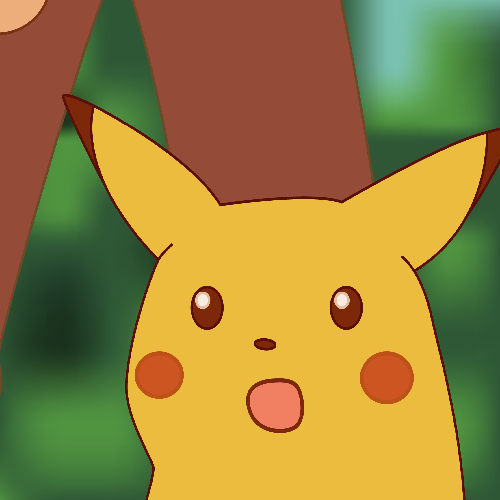
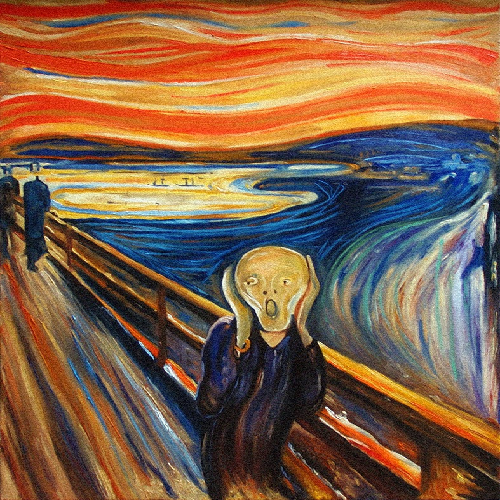
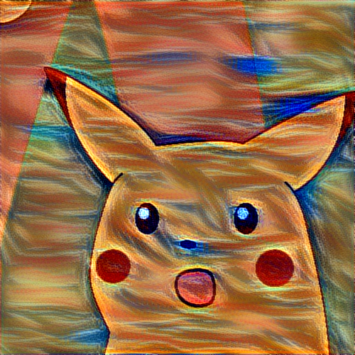
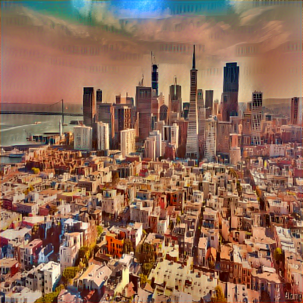

# Neural-Style-Transfer
Neural Style Transfer is a process in which we strive to modify the style of an image while preserving its content. Given an input image and a style image, we can compute an output image with the original content but a new style.

# Steps Involved
1. We take input image and style images and resize them to equal shapes.
2. We load a pre-trained CNN (VGG16).
3. Knowing that we can distinguish layers that are responsible for the style (basic shapes, colors etc.) and the ones responsible for the content (image-specific features), we can separate the layers to independently work on the content and style.
4. Then we set our task as an optimization problem where we are going to minimize:
	* **content loss** (distance between the input and output images - we strive to preserve the content)
	* **style loss** (distance between the style and output images - we strive to apply a new style)
	* **total variation loss** (regularization - spatial smoothness to denoise the output image)
5. Finally, we set our gradients and optimize with the [L-BFGS](https://en.wikipedia.org/wiki/Limited-memory_BFGS) algorithm.

# Results
| ORIGINAL IMAGE | STYLE |  STYLIZED IMAGE  |
 :------------- | :-----------------: |   :-----------------

  
        
  
        
